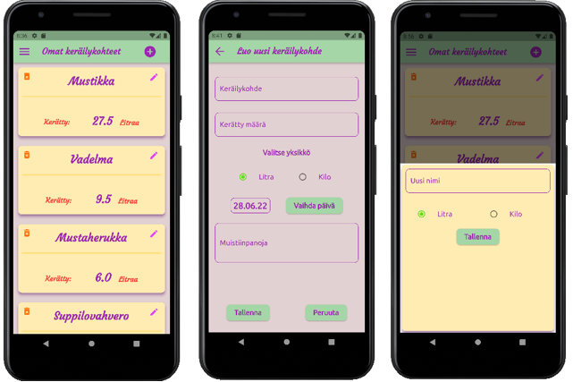
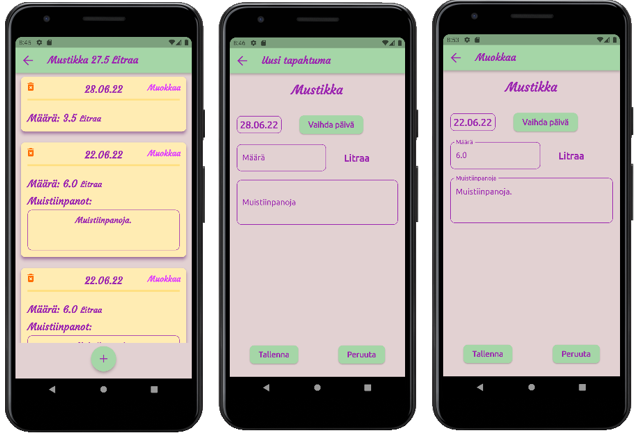
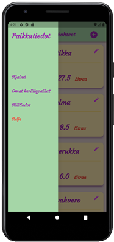
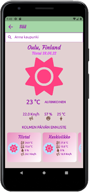
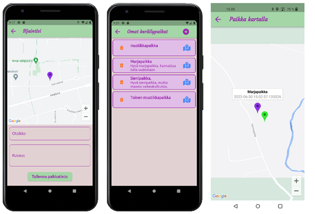

# Flutter_mobile_app

Tämä sovellus on osa kesäprojektia, joka on Oulun ammattikorkeakoulun tietotekniikan tutkinto-ohjelman alakohtaista harjoittelua. Tekijä on Henna Niemi. Sovellus on tehty käyttäen Flutter-sovelluskehystä ja se on tarkoitettu apusovellukseksi marjojen, sienien tms. kerääjille. Sovelluksen avulla käyttäjä voi pitää kirjaa keräämästään sadosta, sekä tallettaa omia keräilypaikkoja ja tarkastella niitä kartalla. Lisäksi käyttäjä voi hakea säätietoja.

Sovelluksen aloitusnäkymä on Omat keräilykohteet -näkymä. Siinä näytetään käyttäjän luomat keräilykohteet kortteina, joissa on kohteen nimi ja siihen mennessä kerätty yhteismäärä. Käyttäjä voi poistaa kohteen painamalla roskakorikuvaketta kortin vasemmassa yläkulmassa.

Ylätyökalurivin pluspainikkeesta avautuu näkymä, jossa käyttäjä voi luoda uuden keräilykohteen. Kohteelle annetaan nimi ja kerätty määrä, valitaan yksiköksi litra tai kilo, sekä valitaan päivämäärä. Lisäksi käyttäjä voi lisätä muistiinpanoja. Sovellus vaatii vähintään nimen antamisen kohteelle. Kahdelle kohteelle ei voi antaa samaa nimeä. Mikäli muihin kenttiin ei syötetä tietoja, tulee määräksi 0.0, yksiköksi litra, päivämääräksi kyseinen päivä ja muistiinpanot jäävät tyhjäksi. Kun käyttäjä painaa Tallenna-painiketta kohteen tiedot tallentuvat laitteen muistiin SQLite-tietokantaan ja sovellus palaa Omat keräilykohteet -näkymään, jonne luotu kohde on lisätty. Peruuta painikkeesta sovellus palaa Omat keräilykohteet -näkymään tallentamatta kohdetta.

Painamalla kynäkuvaketta kortin oikeassa yläkulmassa, avautuu näkymä, jossa voi muokata keräilykohteen nimeä ja vaihtaa keräiltävän yksikön.

Näpäyttämällä keräilykohde-korttia Omat keräilykohteet -näkymässä avautuu näkymä, jossa näkyvät kyseiselle kohteelle merkityt keräilytapahtumat uusimmasta vanhimpaan kortteina, joissa on päivämäärä ja kerätty määrä, sekä muistiinpanot, jos niitä on tapahtumaan lisätty. Tapahtuman voi poistaa painalla roskakorikuvaketta kortin vasemmassa yläkulmassa. 

Painamalla alareunassa olevaa pluspainiketta avautuu näkymä, jossa käyttäjä voi luoda uuden tapahtuman. Hän voi valita päivämäärän, syöttää määrän ja muistiinpanoja. Sovellus vaatii, että vähintään määräkenttään syötetään tietoja. Päivämääräksi tulee automaattisesti kyseinen päivä, jos muuta ei valita.
Painamalla ”muokkaa” tekstiä kortin oikeassa yläkulmassa avautuu näkymä, jossa tapahtuman tietoja voi muokata.

Omat keräilykohteet -näkymässä ylätyökalurivin hampurilaiskuvakkeesta avautuu sivuvalikko, jossa on teksitipainikkeet: Sijainti, Omat keräilypaikat ja Säätiedot. 

Painamalla Säätiedot-painiketta sivuvalikossa, avautuu Sää-näkymä, jossa käyttäjä voi hakea säätietoja kirjoittamalla kaupungin nimen yläreunan tekstikenttään. Näkymässä näytetään sen hetkinen säätieto: sääkuvake, lämpötila, sääkuvaus, tuulennopeus, ilmankosteus ja lämpötilan tuntuma. Alareunassa on vaakasuunnassa skrollattavana listana kolmen päivän ennuste päiväkortteina, joissa esitetään sääkuvake, päivän ylin- ja alin lämpötila, sateen todennäköisyys ja maksimi tuulennopeus. Säänäkymän toteutuksessa on käytetty Weather api -palvelua (https://www.weatherapi.com/ ).  Säätiedot haetaan http-pyyntöinä, ja vastaus palvelusta tulee json-muodossa.

    

Painamalla sivuvalikossa Sijaintipainiketta avautuu karttanäkymä, jossa näytetään käyttäjän sijainti kartalla. Karttanäkymä ja sijainnin seuranta on toteutettu käyttäen Google Maps -palvelua. Sijaintisi-näkymässä käyttäjä voi tallentaa sijaintitietonsa antamalla otsikon, joka on pakollinen kenttä, sekä halutessaan kuvauksen sijaintitiedolle ja painamalla Tallenna paikkatieto -painiketta. Paikkatiedon otsikko, kuvaus ja koordinaatit tallennetaan laitteen muistiin SQLite-tietokantaan. 

Painamalla sivuvalikossa Omat keräilypaikat painiketta käyttäjä voi tarkastella tallentamiaan paikkatietoja. Omat keräilypaikat -näkymässä on lista tallennetuista paikoista. Paikkatiedon voi poistaa painamalla roskakorikuvaketta. Painamalla karttakuvaketta avautuu karttanäkymä, jossa näytetään tallennettu paikka kartalla, sekä käyttäjän sijainti kartalla.

